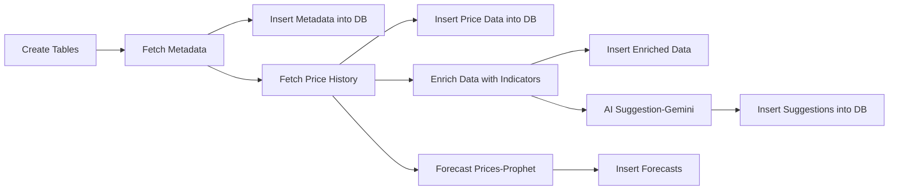

# NSE Market Intelligence Airflow
An **end-to-end data pipeline** built on **Apache Airflow** for fetching, storing, and analyzing **NSE (National Stock Exchange)** market data.  

This project automates:
- Fetching **stock metadata**, **price history**, and **forecasts**
- Generating **AI-based trading suggestions** (Google Gemini)
- Storing results in a **PostgreSQL** database with upsert (`ON CONFLICT`) logic

---

## 📂 Project Structure
```bash
dags/
  stockData-Daily.py
  └── tasks/
      └── stockData/
          ├── create_tables.py          # (or createTables.py) - CREATE TABLE SQL
          ├── fetchMetaData.py         # fetch_stock_metadata (yfinance)
          ├── insertMetaData.py        # upsert into stocks table
          ├── fetchPriceHistory.py     # fetch_price_history (yfinance)
          ├── insertPriceData.py       # upsert into price_history
          ├── forcastPrice.py          # forecast_prices (Prophet)  <-- note: "forcast" spelling in file
          ├── insertForcastData.py     # insert_forecasts (Postgres upserts)
          ├── calculateIndicators.py   # enrich_price_data (pandas_ta)
          ├── insertEnrichedData.py    # insert_enriched_price_data
          ├── geminiSuggestion.py      # get_stock_suggestion_gemini (Google Gemini)
          └── insertSuggestions.py     # insert_stock_suggestions
```
---

## 🚀 Features

- **ETL Automation** – Orchestrated entirely by Apache Airflow
- **Upsert Logic** – Ensures no duplicates and keeps records updated
- **Forecasting** – ML-based stock price predictions
- **AI Insights** – Google Gemini generates investment suggestions with reasoning
- **PostgreSQL Storage** – Reliable, structured storage for analytics

---

## ⚙️ Prerequisites

- **Python 3.9+**
- **Apache Airflow**
- **PostgreSQL**
- Install required Python packages:
  ```bash
  pip install apache-airflow psycopg2 prophet google-generativeai
  ```

## 📊 Data Flow


---

## 📌 Typical Use Cases

- Build NSE stock market dashboards (Superset/Metabase)
- Backtest trading strategies with historical & forecast data
- Automate AI-based investment recommendations
  
